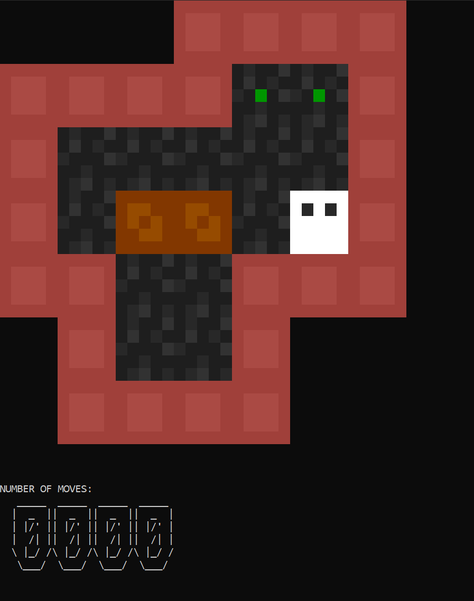

# Sokoban: Terminal Edition
> This is a terminal based version of sokoban which uses ANSI to improve the graphics.

This project is for a university assessment where the goal was to make a text based game. I wanted to create something a bit more advanced which is where I found out you can render "pixels" onto a terminal by using ANSI and then two space characters. Initially I was going to create a 2D survival game but the idea behind the game was too advanced for a university assessment. So I went with Sokoban which has easy to code mechanics that did not take very long to implement. 

## Installation

This is a visual studio 2022 project file. You can open it up in that and then build the game from there
